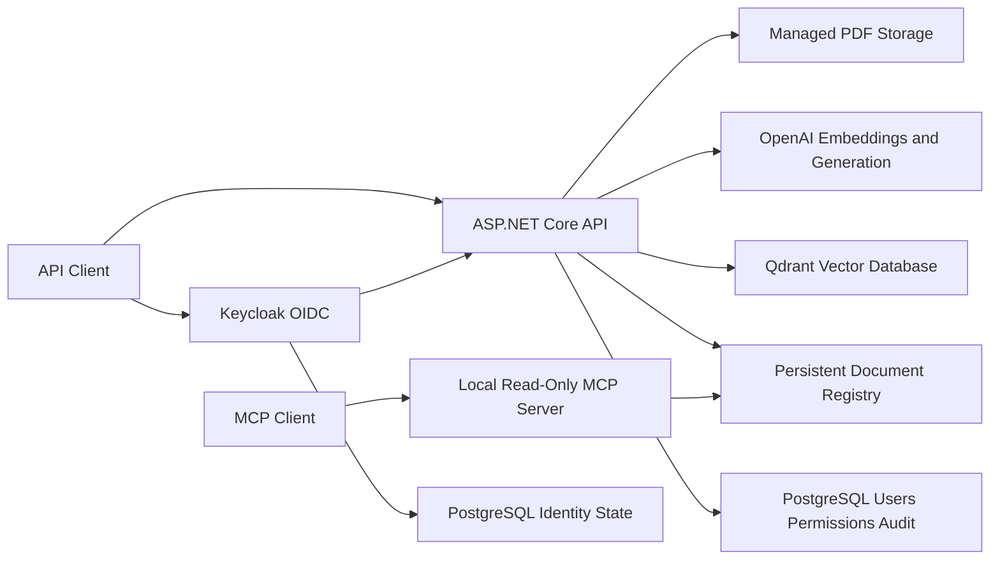

# Enterprise AI Knowledge Assistant

A production-oriented Retrieval-Augmented Generation (RAG) project designed to help developers, technical leads, and architects find trustworthy answers in internal company documentation.

> The source repository is private. Access can be provided to recruiters or technical reviewers upon request.

## Protected Live Demonstration

The Google Cloud production portfolio exposes a Keycloak-protected Swagger page
containing exactly:

```text
GET  /api/portfolio/documents
POST /api/portfolio/ask
```

Review access is privately shared and revocable. The reviewer identity has only
the `portfolio-demo` role, the API can retrieve only two deterministic fictional
Northstar Labs documents, and requests are limited to 10 per authenticated
subject every 60 seconds. Normal reader, learning and administrative APIs are
not published at the production edge.

## Business Problem

Engineering knowledge is often fragmented across architecture documents, API references, coding standards, decision records, and troubleshooting guides. Finding an accurate answer is slow, and ordinary search does not explain which source supports it.

## Product Goal

Provide concise answers grounded in authorized company documents, with inspectable citations containing the document, page, and chunk. When evidence is insufficient, the assistant should refuse to invent an answer.

## Target Users

- Developers
- Technical leads
- Software and enterprise architects

## Current Architecture



### Ingestion

```text
Validate PDF
→ calculate content identity
→ extract page text
→ create overlapping chunks
→ generate embeddings
→ batch vectors into Qdrant
→ persist indexing status
```

### Question Answering

```text
Question
→ validate OIDC access token
→ resolve explicit document permissions
→ create question embedding
→ retrieve only authorized chunks
→ generate a grounded answer
→ return document/page/chunk citations
```

## Implemented Capabilities

- PDF upload and validation
- Page-level text extraction
- Fixed-size overlapping chunking
- OpenAI embeddings and grounded generation
- Qdrant semantic retrieval
- Source citations
- Content-based duplicate prevention
- Stable document and vector identifiers
- Restart-safe ingestion metadata
- Recoverable indexing status
- Batched vector writes
- Versioned RAG evaluation dataset
- Deterministic fact, stable-document citation, and refusal scoring
- Cost-aware evaluation CLI with targeted case execution
- End-to-end evaluation latency measurement
- Automated build and tests with GitHub Actions
- Configurable Qdrant retrieval threshold with explicit no-evidence refusal
- Bounded single-tool agent workflow using the OpenAI Responses API
- Strict read-only document-catalog tool with inspectable execution traces
- Versioned agent policy cases with deterministic structural trace scoring
- Internal agent evaluation CLI with targeted case execution
- AI request observability and cost control for every AI provider call: RAG,
  bounded agent, and structured-action planning, tagged by surface
- Configurable per-model cost estimation, latency/cost/failure/rolling
  failure-rate alert thresholds, and a bounded administrator telemetry
  read endpoint
- Provider timeout, retry, and circuit-breaker resilience on all four
  outbound AI provider clients (OpenAI chat, embeddings, Responses API,
  Qdrant), with retry counts recorded on both recovered and hard failures
- Strict JSON Schema output for a simulated high-impact document action
- Application-validated pending, approved, and rejected proposal state
- Atomic single-decision enforcement and simulation-only approval results
- Local stdio MCP server with one safe `find_documents` tool
- Shared protocol-neutral catalog query used by both agent and MCP adapters
- Portable Keycloak OIDC authentication with strict JWT validation
- EF Core and PostgreSQL identity links, document permissions, and audit events
- Administrator policies for ingestion, permissions, and governed actions
- Document scope enforced through listing, RAG, Qdrant, and agent tools
- Docker Compose topology for API, Keycloak, separate PostgreSQL databases, and
  Qdrant
- Production Nginx TLS edge with private backend networks and file-mounted
  secrets
- Controlled EF migration, Qdrant, Keycloak and fictional-corpus initialization
  jobs
- Verified backup and restore automation with checksums and public smoke tests
- Dual-platform AMD64/ARM64 GHCR image with SBOM, provenance and immutable
  digest deployment
- Protected production Swagger with a dedicated role, exact fictional scope,
  rate limiting and no administrative exposure

## Technology Stack

- C# and .NET 10 LTS
- ASP.NET Core Web API
- Keycloak and OpenID Connect
- PostgreSQL with EF Core and Npgsql
- OpenAI API
- Qdrant
- Model Context Protocol official C# SDK
- Microsoft.Extensions.Http.Resilience (timeout, retry, circuit breaker)
- PdfPig
- xUnit
- Docker
- GitHub Actions

## Engineering Evidence

- Clean build with zero compiler warnings
- 118 automated security, persistence, ingestion, retrieval, evaluation,
  provider, controller, agent-orchestration, structured-output, approval,
  catalog, observability, and MCP protocol tests
- Duplicate content rejected even under another filename
- Vector identifiers cannot collide across documents
- Stable `DocumentId` prevents filename ambiguity in citation evaluation
- Five-case live OpenAI/Qdrant baseline recorded with fact, citation, refusal, and latency evidence
- Six retrieval thresholds evaluated; the current `0.20` default preserved the
  5/5 baseline at 1,926 ms average latency
- Agent tests prove strict provider mapping, bounded execution, single-call
  policy, status/name filtering, and exclusion of local paths and content hashes
- Agent policy tests prove exact tool selection and stopping expectations,
  recursive sensitive-metadata checks, unknown-tool rejection, safe tool
  failures, malformed/incomplete provider rejection, and DI composition
- A live two-turn Responses API run invoked `find_documents`, returned two
  indexed documents, and produced a completed answer with an execution trace
- Swagger verification proved a structured deletion proposal requires a
  separate decision, repeated decisions conflict, and approval leaves the
  document registry unchanged
- A real MCP client test launches the server over stdio, discovers exactly one
  read-only/non-destructive tool, calls it, rejects an invalid status, and
  verifies sensitive registry fields are absent
- Security tests prove strict issuer/audience/signature/lifetime validation,
  fail-closed endpoint policy, stable issuer/subject user links, idempotent
  grants, durable audit, empty-scope refusal, and Qdrant provider-output checks
- EF migration discovery, model comparison, and idempotent PostgreSQL SQL
  generation are verified
- Keycloak, PostgreSQL, Qdrant, API and Nginx run in the verified production
  Compose topology on Google Cloud
- Hosted quality gates verify formatting, warning-free builds, deterministic
  tests and PDFs, migrations, shell/Keycloak/Compose contracts, and AMD64/ARM64
  production images
- The protected workflow publishes an immutable GHCR digest and deploys it
  through pinned SSH only after human production approval
- Hosted trusted-TLS smoke tests prove health, the two-operation Swagger
  contract, anonymous `401`, and public-edge `404` isolation
- Every AI provider call (RAG, bounded agent, structured-action planning) is
  measured for latency, token use, estimated cost, outcome, and retry count,
  live-verified through Swagger against real OpenAI/Qdrant calls, including
  a recorded edge case where OpenAI returned a dated snapshot model name
  that the cost estimator's fallback matching still priced correctly
- Provider timeout/retry/circuit-breaker resilience is live-verified against
  a real induced Qdrant outage in both directions: a recovered transient
  failure records a successful outcome with a non-zero retry count, and a
  sustained outage records a failed outcome that also reports how many
  attempts were made before giving up
- Secrets excluded from source control

## Security Approach

The product handles internal architecture, API, coding-standard, decision, and
troubleshooting documents. Keycloak authenticates users without the application
storing passwords. The API validates OIDC access tokens and owns document
authorization in PostgreSQL. Authorization is enforced before catalog, vector,
RAG, and agent access; permission changes and governed decisions are audited.
Production terminates trusted TLS at Nginx, keeps service networks private,
mounts secrets from protected host files, runs controlled migrations, and has
verified backup/restore scripts. The public portfolio adds an exact fictional
document allow-list, a dedicated low-authority role and per-subject rate limit.
Every AI provider call is measured (latency, token use, estimated cost, retry
count, and outcome, with no prompt/answer/document content recorded) and
protected by timeout/retry/circuit-breaker resilience; both are implemented
and locally verified but not yet deployed to production. Query audit,
distributed tracing and automated rollback remain incomplete.

## Current Limitations

- The first baseline is limited to five cases over one document and exact text matching
- The initial retrieval threshold exists, but recall@K and precision@K are not
  yet measured over representative multi-document data
- The local JSON metadata registry supports only a single application instance
- AI request telemetry (token use, cost, latency, retry count, outcome) and
  provider resilience are implemented and locally verified but not yet
  deployed to production; general HTTP request metrics and distributed
  tracing remain unimplemented
- The agent endpoint is authenticated and document-scoped but still has one
  read-only tool, relies on stored provider response state, has only three
  non-adversarial policy cases, and does not persist its execution trace
- The approval workflow uses authenticated reviewer identity and durable
  decision audit but stores proposals only in process memory and intentionally
  has no real deletion capability
- The MCP server is local-only and OS-trusted; it reads the whole local registry
  and must not be exposed remotely
- The portfolio reviewer credential is shared and the in-memory rate limiter
  resets on API restart, so this is a bounded single-instance demonstration
- Automatic release rollback and multi-host availability are not implemented
- Backup/restore automation exists, but encrypted off-host scheduling and timed
  recovery objectives remain to be demonstrated continuously

## Roadmap

AI request observability/cost control and provider resilience are both
implemented and locally verified; the next milestone is deploying and
hosted-verifying them against production, followed by a bounded local-model
proof of concept (on-device inference for private or cost-sensitive
requests, routed alongside the existing cloud path) once approved.

## CI/CD

GitHub Actions implements reusable quality, publication and deployment gates:

- Restore dependencies
- Verify formatting, warning-free builds, 118 deterministic tests and migrations
- Validate shell, Keycloak, Compose and deterministic fictional-PDF contracts
- Build and inspect AMD64 and ARM64 production images
- Publish SBOM/provenance with a commit tag and immutable digest
- Deploy only reviewed `main` through the protected production environment
- Require initialization, readiness and trusted-TLS smoke tests before recording
  the digest

The current single-host Google Cloud deployment remains Compose-based and
portable; Kubernetes and additional cloud-specific infrastructure are not
justified at this stage.

## Repository Access

This public repository is a portfolio case study. The private implementation can be shared with verified recruiters or technical interviewers upon request.

## Author

**Elie Saber**  
Senior .NET Engineer and Technical Lead developing production AI engineering and Enterprise AI Architecture capability.
