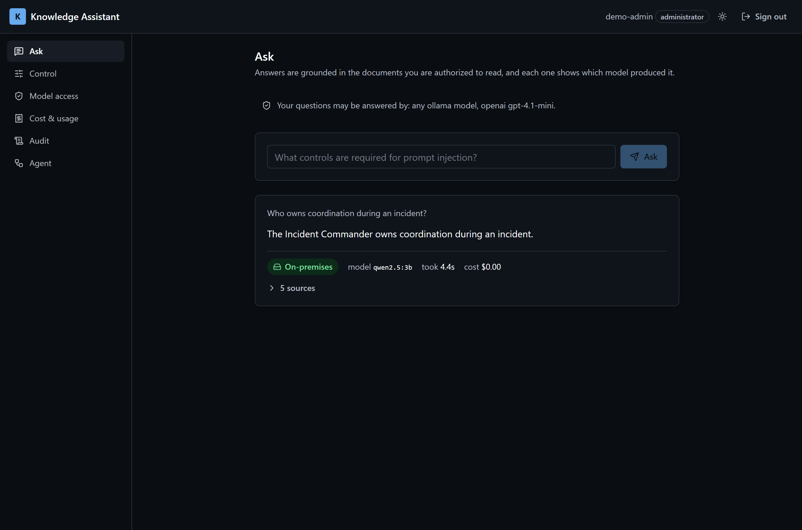
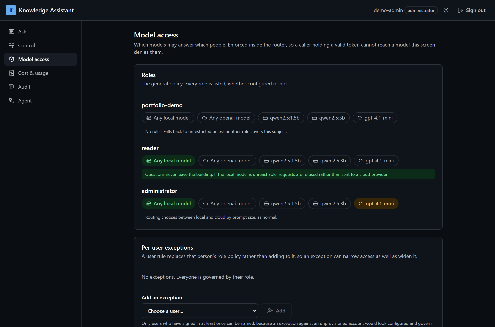
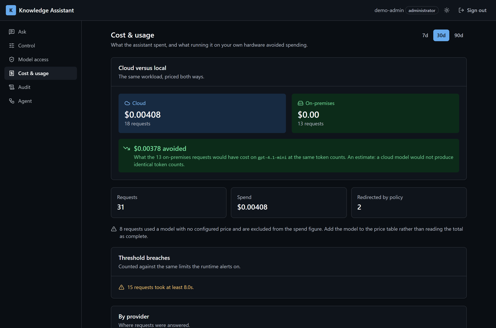
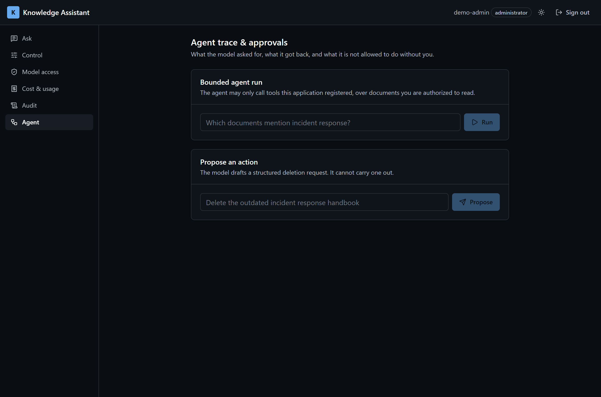
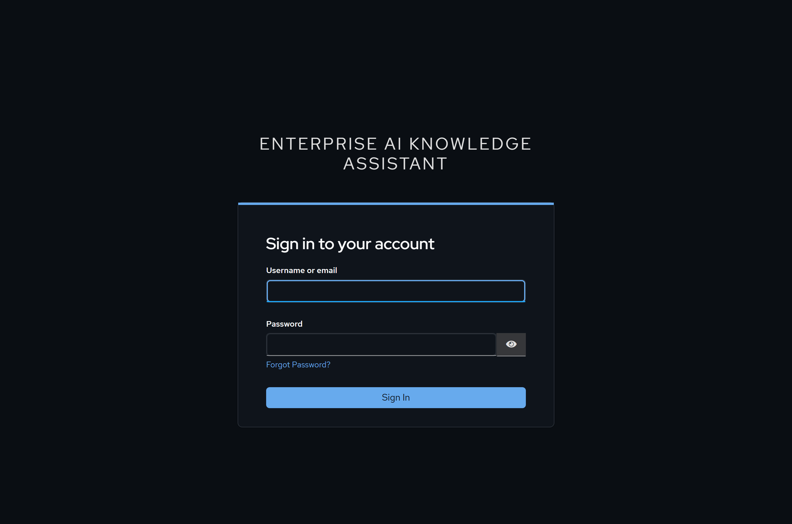
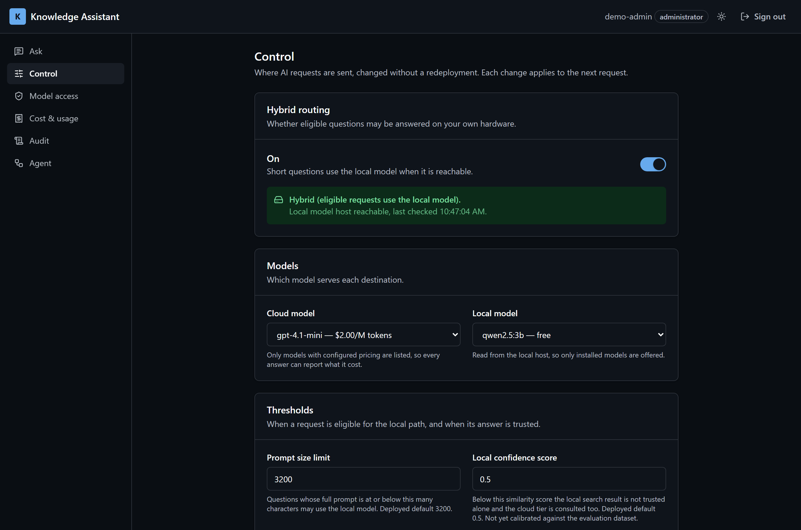
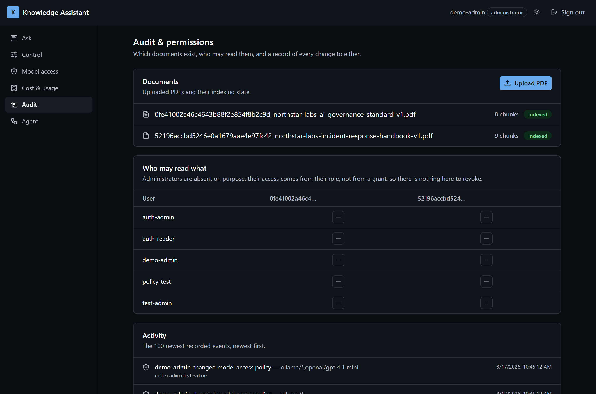
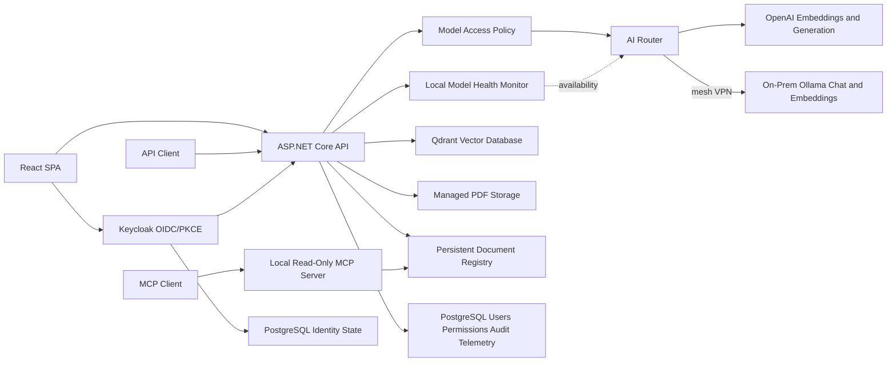

# Enterprise AI Knowledge Assistant

A production-oriented Retrieval-Augmented Generation system that answers
questions from internal company documents, shows the evidence behind every
answer, and lets an administrator decide **which models are allowed to answer
which people**.

> The implementation repository is private. Access can be provided to
> recruiters or technical reviewers on request.



Everything in that bar under the answer is the product's argument. The
question was answered **on the organization's own hardware**, by a named
model, in a measured time, at a cost of nothing, from five citable sources —
and the user can see all of it without asking anyone.

---

## The problem this is built for

Enterprise buyers have been burned. Reporting through 2026 puts roughly 95% of
generative-AI pilots at no measurable profit-and-loss impact, so a polished
demonstration now increases suspicion rather than reducing it. Two things
reduce it: provable numbers, and being able to see what the system did.

Two further constraints shaped the design:

- **"Saves four hours a week" has stopped working as a pitch**, because saved
  hours do not appear in a budget. Cost per request, and the difference between
  cloud and local for the same request, do.
- **Some questions must not leave the building.** Not as a preference — as a
  condition of the system being usable at all.

---

## Three things worth looking at

### 1. Model access policy — who may be answered by what



An administrator maps roles — and individually named users, as documented
exceptions — to the providers and models permitted to answer them. The
sentence under each row states the consequence in the terms the decision is
actually made in:

> *Questions never leave the building. If the local model is unreachable,
> requests are refused rather than sent to a cloud provider.*

**The policy is enforced inside the AI router, not in the client.** Hiding a
model in a dropdown is decoration; anyone holding a valid token and a shell
bypasses it. Because enforcement sits where every authenticated request
already funnels through, there is no second path around it.

Policy outranks the routing preference in **both** directions:

| Routing would choose | Policy permits | Result |
| --- | --- | --- |
| Local (short prompt) | Cloud only | Cloud, flagged as redirected by policy |
| Cloud (long prompt) | Local only | **Local**, flagged as redirected by policy |
| Either | Local only, local unreachable | **Refused** — nothing sent to any cloud |
| Local, then local fails mid-request | Local only | **Refused** — the fallback is policy-aware |
| Either | Nothing that can answer | **Refused** before any provider is called |

The fourth row is the one that took the most care. A local model that accepts
a request and then dies is the likeliest real-world failure, and the existing
"retry against the cloud" fallback would have defeated the policy on exactly
the request it was written for.

A refusal is recorded as its own outcome rather than as a failure, so a
correctly restrictive policy never makes the service look unreliable, and it
writes an audit entry naming the caller. *"Their questions never left the
building"* is a query, not a claim.

### 2. Cost, and what running locally avoided spending



Cloud spend and on-premises spend for the same workload, side by side, plus
the figure a budget holder actually acts on: **what the locally answered
requests would have cost on the cloud model**, computed from their measured
token counts.

It is labelled as an estimate, and it names the model it was priced against so
the number can be checked rather than trusted. Three deliberate refusals to
overstate:

- When the comparison model has no configured price, the screen claims **no
  saving at all** rather than showing a zero. "We cannot say" and "it saves
  nothing" are different claims.
- Requests using an unpriced model are **called out wherever they affect a
  total**, including per row. A spend figure quietly missing requests is worse
  than one that admits what it excludes.
- The threshold panel appears **only when something actually breached**. A
  permanently visible panel of zeroes teaches a reader to ignore the place
  warnings appear.

### 3. A model may propose, but not execute



The bounded agent shows every tool call with the arguments the model sent and
what came back, unmodified — pretty-printed only when the payload is valid
JSON, and left exactly as received when it is not, because a trace that
silently rewrites what the model sent is worth less than no trace.

High-impact actions are drafted as structured proposals carrying the model's
own stated reason and risk summary, and require an explicit human approve or
reject. The simulation notice is prominent and never conditional on anything
the model said: a reviewer pressing approve must know, without reading
closely, that nothing is about to be deleted.

---

## The rest of the interface

| | |
| --- | --- |
|  | **Sign-in.** Keycloak OIDC with PKCE, themed to match the application so the identity provider does not read as a seam between two systems. Restyled with CSS over Keycloak's own theme, with no template overridden — a copied template is a fork of Keycloak's login markup that stops receiving upstream fixes. |
|  | **Control.** Hybrid routing, model selection and thresholds, changed without a redeployment. Cloud models are restricted to those with known pricing so cost estimation cannot silently return null; local models are listed from what the model host actually has installed. Every change writes an audit entry. |
|  | **Audit & permissions.** Documents with live indexing status, a per-user document grant matrix, and a timeline of every grant, revoke, approval and configuration change — with the actor named rather than shown as an identifier. |

---

## Live demonstration

A Keycloak-protected Swagger page on the deployed Google Cloud environment
exposes exactly two operations:

```text
GET  /api/portfolio/documents
POST /api/portfolio/ask
```

Review access is privately shared and revocable. The reviewer identity holds
only the `portfolio-demo` role, the API can reach only two deterministic
fictional documents, and requests are limited to 10 per authenticated subject
every 60 seconds. Reader, learning and administrative APIs are not published
at the production edge.

---

## Architecture



Two decisions in that diagram carry most of the weight. **Model access policy
sits in front of the router**, so it constrains provider selection rather than
merely reporting on it. **The health monitor feeds the router**, so an
unreachable local model degrades to the cloud automatically — except where
policy forbids it, in which case the request is refused instead.

### Question answering

```text
Question
→ validate OIDC access token
→ resolve explicit document permissions
→ embed the question and retrieve only authorized chunks
→ resolve the caller's permitted models
→ select a permitted provider, or refuse
→ generate a grounded answer
→ return citations, provider, model, latency and cost
```

---

## Technology

C# and .NET 10 LTS · ASP.NET Core · React, TypeScript, Vite, Tailwind ·
Keycloak and OpenID Connect · PostgreSQL with EF Core · Qdrant · OpenAI ·
Ollama with Microsoft.Extensions.AI · Tailscale (WireGuard mesh VPN) ·
Model Context Protocol C# SDK · Microsoft.Extensions.Http.Resilience ·
PdfPig · xUnit · Docker · GitHub Actions

---

## Engineering evidence

- **216 automated tests** covering security, persistence, ingestion,
  retrieval, evaluation, providers, controllers, agent orchestration,
  structured output, approvals, model access policy, cost aggregation,
  observability and MCP protocol behavior. Warning-free builds.
- **Quality gates on every pull request in both repositories**: formatting,
  warning-free builds, deterministic tests, migration model verification,
  shell/Keycloak/Compose contract checks, AMD64 and ARM64 production images,
  and lint/type-check/build for the web application.
- **Deployment publishes an immutable GHCR digest** with SBOM and provenance,
  and deploys only reviewed `main` through a protected environment after human
  approval, gated on initialization, readiness and trusted-TLS smoke tests.

### Verified against a running system, not asserted

Each of these was exercised end to end rather than inferred from tests:

- **A policy refusal.** With a role restricted to the local model and that
  model stopped, a question returned `403` with nothing sent to any cloud
  provider, recorded as a policy denial in telemetry and an audit event
  naming the caller. With the model running, the same policy kept a prompt too
  long for local routing on the local model anyway.
- **The full local retrieval path.** A document indexed with local embeddings
  into the local vector collection, then answered from a question embedded and
  searched locally, with zero cloud calls — confirmed directly against the
  vector database rather than from application logs.
- **Automatic failover, both directions.** Local model serving, stopped
  mid-session, detected within one health interval, a real question answered
  by the cloud provider with no user-visible failure, then automatic recovery
  without a restart.
- **Provider resilience under a real induced outage.** A recovered transient
  failure records a successful outcome with a non-zero retry count; a sustained
  outage records a failure that still reports how many attempts were made.
- **The cloud-to-on-prem connector in production.** The deployed Google Cloud
  host reaches an on-premises model over an outbound-only mesh VPN, with no
  inbound firewall rule and no public exposure of the model.
- **Hybrid operation through the deployed public surface.** A governance
  question returned four correct controls with accurate citations, served by
  the on-premises model, with provider and model recorded in telemetry.

### What live testing changed

Live verification has found something the test suite could not at **five
consecutive milestones**, including this one. Most of these were not logic
errors that better unit tests would have caught — they were assumptions about
what the outside world actually emits, or about which path a real user takes.

- A routing threshold measured the bare question rather than the full
  retrieved-context prompt, so it never fired in practice.
- A resilience timeout budget tuned for cloud latency killed CPU-bound local
  inference that was still working.
- A retrieval cascade designed to fall back on empty results could never fire,
  because the local embedding model scored a question about an entirely
  unrelated subject at 0.466 against the corpus.
- A 1.5B local model answered a grounded question in 1.6 seconds but
  contradicted its own citations; a 3B model answered correctly and was adopted
  with the added latency accepted and recorded rather than hidden.
- Every request was recording the identity provider's own bookkeeping roles
  alongside the application's, which made per-role spend unreadable and
  provider-specific.
- Deep-linking to an administrator screen bounced to the default page, because
  those routes mount only after a capability check resolves. Found by loading a
  URL directly — which is how a returning user arrives — rather than by
  clicking through.

---

## What this does not do

Stated because a system's limits are part of its specification, and being
first to name one is the cheapest way to control how it is discussed.

- **Routing does not classify data.** Model access policy narrows *who* may
  reach *which model*; it does not inspect *what is being sent*. A requirement
  such as "regulated data must never leave the building" needs a
  classification layer built first, and is not claimed as satisfied.
- **Runtime guardrails are not built.** No PII detection, no prompt-injection
  checking, no post-action validation of what an agent did.
- **Local inference is not interactive on the demonstration hardware.** A
  grounded answer takes roughly 57 seconds on a CPU-only 2017 ultrabook against
  about 5 seconds from the cloud provider. This is a hardware limit rather than
  an architectural one, accepted deliberately so the hybrid path stays genuinely
  active.
- **The on-prem connector is a device-authenticated VPN** without per-service
  access control lists, and the local model endpoint has no authentication of
  its own — acceptable for a single-owner network, insufficient for a shared or
  client network. Prompt content crosses it protected by transport encryption,
  so an on-premises model inherits the same data-sensitivity considerations as
  any other provider rather than being automatically safer for being local.
- **The approval workflow has no real execution capability** and stores
  proposals only in process memory.
- **The agent has one read-only tool**, three non-adversarial policy cases, and
  does not persist its execution trace.
- **The retrieval baseline is five cases over one document.** Recall@K and
  precision@K are not yet measured over representative multi-document data, and
  the retrieval cascade's confidence threshold is configurable but not
  calibrated — it compares similarity scores across two embedding models whose
  scales are not strictly comparable. A reranker is the recorded principled
  improvement.
- **The document registry is a local JSON file**, so the application runs as a
  single instance.
- **The MCP server is local-only and OS-trusted.** It reads the whole local
  registry and must not be exposed remotely.
- Automatic release rollback and multi-host availability are not implemented.
  Backup and restore automation exists and is verified, but encrypted off-host
  scheduling and timed recovery objectives are not demonstrated continuously.

---

## What comes next

Runtime guardrails — tool-call authorization, rate limits, PII and
prompt-injection checks, and post-action validation — before any of these
paths are exposed more broadly. That gap is tracked deliberately rather than
deferred quietly: model access policy answered *who*, and *what is being sent*
is the question still open.

The single-host Google Cloud deployment remains Compose-based and portable.
Kubernetes and further cloud-specific infrastructure are not justified at this
stage, and adding them to look production-grade would be the wrong reason.

---

## Repository access

This public repository is a portfolio case study. The private implementation
can be shared with verified recruiters or technical interviewers on request.

## Author

**Elie Saber**
Senior .NET Engineer and Technical Lead, developing production AI engineering
and Enterprise AI Architecture capability.
