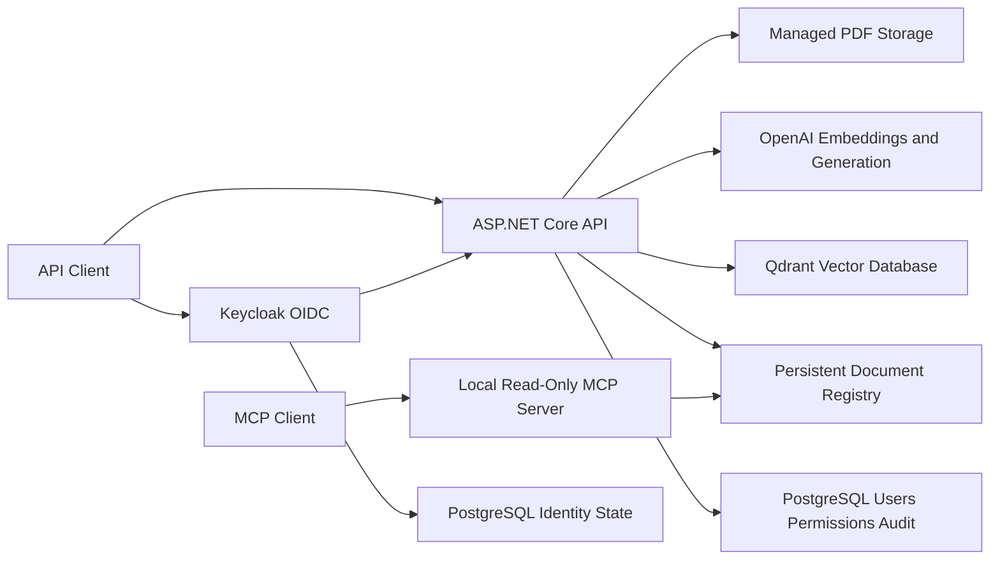

# Enterprise AI Knowledge Assistant

A production-oriented Retrieval-Augmented Generation (RAG) project designed to help developers, technical leads, and architects find trustworthy answers in internal company documentation.

> The source repository is private. Access can be provided to recruiters or technical reviewers upon request.

## Business Problem

Engineering knowledge is often fragmented across architecture documents, API references, coding standards, decision records, and troubleshooting guides. Finding an accurate answer is slow, and ordinary search does not explain which source supports it.

## Product Goal

Provide concise answers grounded in authorized company documents, with inspectable citations containing the document, page, and chunk. When evidence is insufficient, the assistant should refuse to invent an answer.

## Target Users

- Developers
- Technical leads
- Software and enterprise architects

## Current Architecture



### Ingestion

```text
Validate PDF
→ calculate content identity
→ extract page text
→ create overlapping chunks
→ generate embeddings
→ batch vectors into Qdrant
→ persist indexing status
```

### Question Answering

```text
Question
→ validate OIDC access token
→ resolve explicit document permissions
→ create question embedding
→ retrieve only authorized chunks
→ generate a grounded answer
→ return document/page/chunk citations
```

## Implemented Capabilities

- PDF upload and validation
- Page-level text extraction
- Fixed-size overlapping chunking
- OpenAI embeddings and grounded generation
- Qdrant semantic retrieval
- Source citations
- Content-based duplicate prevention
- Stable document and vector identifiers
- Restart-safe ingestion metadata
- Recoverable indexing status
- Batched vector writes
- Versioned RAG evaluation dataset
- Deterministic fact, stable-document citation, and refusal scoring
- Cost-aware evaluation CLI with targeted case execution
- End-to-end evaluation latency measurement
- Automated build and tests with GitHub Actions
- Configurable Qdrant retrieval threshold with explicit no-evidence refusal
- Bounded single-tool agent workflow using the OpenAI Responses API
- Strict read-only document-catalog tool with inspectable execution traces
- Versioned agent policy cases with deterministic structural trace scoring
- Internal agent evaluation CLI with targeted case execution
- Strict JSON Schema output for a simulated high-impact document action
- Application-validated pending, approved, and rejected proposal state
- Atomic single-decision enforcement and simulation-only approval results
- Local stdio MCP server with one safe `find_documents` tool
- Shared protocol-neutral catalog query used by both agent and MCP adapters
- Portable Keycloak OIDC authentication with strict JWT validation
- EF Core and PostgreSQL identity links, document permissions, and audit events
- Administrator policies for ingestion, permissions, and governed actions
- Document scope enforced through listing, RAG, Qdrant, and agent tools
- Docker Compose topology for API, Keycloak, separate PostgreSQL databases, and
  Qdrant

## Technology Stack

- C# and .NET 10 LTS
- ASP.NET Core Web API
- Keycloak and OpenID Connect
- PostgreSQL with EF Core and Npgsql
- OpenAI API
- Qdrant
- Model Context Protocol official C# SDK
- PdfPig
- xUnit
- Docker
- GitHub Actions

## Engineering Evidence

- Clean build with zero compiler warnings
- Fifty-three automated security, persistence, ingestion, retrieval,
  evaluation, provider, controller, agent-orchestration, structured-output,
  approval, catalog, and MCP protocol tests
- Duplicate content rejected even under another filename
- Vector identifiers cannot collide across documents
- Stable `DocumentId` prevents filename ambiguity in citation evaluation
- Five-case live OpenAI/Qdrant baseline recorded with fact, citation, refusal, and latency evidence
- Six retrieval thresholds evaluated; the current `0.20` default preserved the
  5/5 baseline at 1,926 ms average latency
- Agent tests prove strict provider mapping, bounded execution, single-call
  policy, status/name filtering, and exclusion of local paths and content hashes
- Agent policy tests prove exact tool selection and stopping expectations,
  recursive sensitive-metadata checks, unknown-tool rejection, safe tool
  failures, malformed/incomplete provider rejection, and DI composition
- A live two-turn Responses API run invoked `find_documents`, returned two
  indexed documents, and produced a completed answer with an execution trace
- Swagger verification proved a structured deletion proposal requires a
  separate decision, repeated decisions conflict, and approval leaves the
  document registry unchanged
- A real MCP client test launches the server over stdio, discovers exactly one
  read-only/non-destructive tool, calls it, rejects an invalid status, and
  verifies sensitive registry fields are absent
- Security tests prove strict issuer/audience/signature/lifetime validation,
  fail-closed endpoint policy, stable issuer/subject user links, idempotent
  grants, durable audit, empty-scope refusal, and Qdrant provider-output checks
- EF migration discovery, model comparison, and idempotent PostgreSQL SQL
  generation are verified
- Keycloak realm JSON and Docker Compose configuration are validated; live
  container startup remains pending because Docker was unavailable
- CI runs restore, build, and tests on pushes and pull requests
- Secrets excluded from source control

## Security Approach

The product handles internal architecture, API, coding-standard, decision, and
troubleshooting documents. Keycloak authenticates users without the application
storing passwords. The API validates OIDC access tokens and owns document
authorization in PostgreSQL. Authorization is enforced before catalog, vector,
RAG, and agent access; permission changes and governed decisions are audited.
Production TLS, managed secrets, query audit, backup/recovery, and provider data
policies remain required.

## Current Limitations

- The first baseline is limited to five cases over one document and exact text matching
- The initial retrieval threshold exists, but recall@K and precision@K are not
  yet measured over representative multi-document data
- The local JSON metadata registry supports only a single application instance
- Production observability and verified cloud deployment are not yet complete
- Qdrant collection provisioning is not automated
- The agent endpoint is authenticated and document-scoped but still has one
  read-only tool, relies on stored provider response state, has only three
  non-adversarial policy cases, and does not persist its execution trace
- The approval workflow uses authenticated reviewer identity and durable
  decision audit but stores proposals only in process memory and intentionally
  has no real deletion capability
- The MCP server is local-only and OS-trusted; it reads the whole local registry
  and must not be exposed remotely
- Local Keycloak uses development mode and HTTP; production identity hardening,
  live container verification, and backup/restore remain

## Roadmap

The single recommended next milestone is a portable production deployment and
operability baseline with TLS, managed secrets, controlled migrations,
health/readiness checks, backup/restore evidence, and an authenticated
end-to-end smoke test.

Production hardening remains a separate track and will be prioritized when a
real client, deployment, or job opportunity creates concrete requirements.

## CI/CD

GitHub Actions currently performs continuous integration:

- Restore dependencies
- Build the API and tests
- Run automated tests

A cloud-neutral deployment will be added after production TLS, secrets,
migrations, health, backup, and cost controls are defined.

## Repository Access

This public repository is a portfolio case study. The private implementation can be shared with verified recruiters or technical interviewers upon request.

## Author

**Elie Saber**  
Senior .NET Engineer and Technical Lead developing production AI engineering and Enterprise AI Architecture capability.
