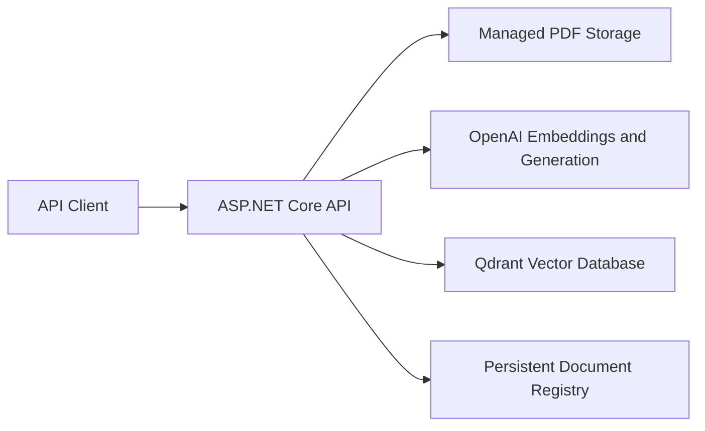

# Enterprise AI Knowledge Assistant

A production-oriented Retrieval-Augmented Generation (RAG) project designed to help developers, technical leads, and architects find trustworthy answers in internal company documentation.

> The source repository is private. Access can be provided to recruiters or technical reviewers upon request.

## Business Problem

Engineering knowledge is often fragmented across architecture documents, API references, coding standards, decision records, and troubleshooting guides. Finding an accurate answer is slow, and ordinary search does not explain which source supports it.

## Product Goal

Provide concise answers grounded in authorized company documents, with inspectable citations containing the document, page, and chunk. When evidence is insufficient, the assistant should refuse to invent an answer.

## Target Users

- Developers
- Technical leads
- Software and enterprise architects

## Current Architecture



### Ingestion

```text
Validate PDF
→ calculate content identity
→ extract page text
→ create overlapping chunks
→ generate embeddings
→ batch vectors into Qdrant
→ persist indexing status
```

### Question Answering

```text
Question
→ create question embedding
→ retrieve relevant chunks
→ generate a grounded answer
→ return document/page/chunk citations
```

## Implemented Capabilities

- PDF upload and validation
- Page-level text extraction
- Fixed-size overlapping chunking
- OpenAI embeddings and grounded generation
- Qdrant semantic retrieval
- Source citations
- Content-based duplicate prevention
- Stable document and vector identifiers
- Restart-safe ingestion metadata
- Recoverable indexing status
- Batched vector writes
- Versioned RAG evaluation dataset
- Deterministic fact, stable-document citation, and refusal scoring
- Cost-aware evaluation CLI with targeted case execution
- End-to-end evaluation latency measurement
- Automated build and tests with GitHub Actions
- Configurable Qdrant retrieval threshold with explicit no-evidence refusal
- In-progress agent fundamentals with strict tool contracts and a read-only
  document-catalog tool

## Technology Stack

- C# and .NET 10 LTS
- ASP.NET Core Web API
- OpenAI API
- Qdrant
- PdfPig
- xUnit
- Docker
- GitHub Actions

## Engineering Evidence

- Clean build with zero compiler warnings
- Twelve automated persistence, ingestion, retrieval, evaluation, and agent-tool
  tests
- Duplicate content rejected even under another filename
- Vector identifiers cannot collide across documents
- Stable `DocumentId` prevents filename ambiguity in citation evaluation
- Five-case live OpenAI/Qdrant baseline recorded with fact, citation, refusal, and latency evidence
- Six retrieval thresholds evaluated; the current `0.20` default preserved the
  5/5 baseline at 1,926 ms average latency
- Agent-tool test proves status/name filtering and prevents local file paths and
  content hashes from reaching the model
- CI runs restore, build, and tests on pushes and pull requests
- Secrets excluded from source control

## Security Approach

The product handles internal architecture, API, coding-standard, decision, and troubleshooting documents. Current security work includes controlled file paths, PDF validation, secret isolation, and content identity. Authentication, document-level authorization, auditability, and provider data policies remain required before production use.

## Current Limitations

- Authentication and document permissions are not yet implemented
- The first baseline is limited to five cases over one document and exact text matching
- The initial retrieval threshold exists, but recall@K and precision@K are not
  yet measured over representative multi-document data
- The local JSON metadata registry supports only a single application instance
- Production observability and cloud deployment are not yet complete
- Qdrant collection provisioning is not automated
- The agent learning slice does not yet have a model adapter, orchestration loop,
  dependency-injection registration, or API endpoint

## Roadmap

The learning strategy is breadth-first, followed by deeper iterations:

1. Complete the bounded single-tool agent loop
2. Add structured outputs and agent evaluation
3. Build multi-document retrieval metrics and advanced RAG
4. Explore multimodal AI, MCP, workflow state, and human approval
5. Explore multi-agent orchestration after single-agent behavior is clear

Production hardening remains a separate track and will be prioritized when a
real client, deployment, or job opportunity creates concrete requirements.

## CI/CD

GitHub Actions currently performs continuous integration:

- Restore dependencies
- Build the API and tests
- Run automated tests

Azure deployment will be added after the deployment architecture, secrets, and cost controls are defined.

## Repository Access

This public repository is a portfolio case study. The private implementation can be shared with verified recruiters or technical interviewers upon request.

## Author

**Elie Saber**  
Senior .NET Engineer and Technical Lead developing production AI engineering and Enterprise AI Architecture capability.
