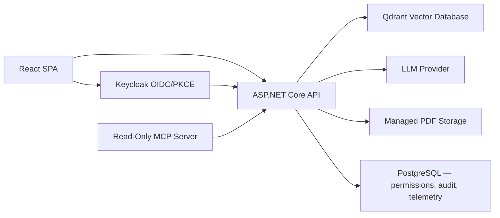

# Enterprise AI Knowledge Assistant

A production-oriented Retrieval-Augmented Generation system that answers
questions from internal company documents, shows the evidence behind every
answer, and includes a bounded agent that can propose actions but never
execute them.

> The implementation repository is private. Access can be provided to
> recruiters or technical reviewers on request. A live, credential-protected
> demonstration is available — see below.

---

## The problem this is built for

Enterprise buyers have been burned. Reporting through 2026 puts roughly 95% of
generative-AI pilots at no measurable profit-and-loss impact, so a polished
demonstration now increases suspicion rather than reducing it.

So the design goal was not "a smarter chatbot" but **a system a cautious
buyer can inspect** — every answer traceable to its sources, every quality
claim backed by a test or a measurement rather than a screenshot.

---

## What it does

- **Grounded answers with provenance.** Every answer carries its citations,
  the model that produced it, and how long it took. An answer with no
  supporting evidence is a refusal, shown plainly, not a guess.
- **Modern retrieval.** Hybrid dense and sparse (BM25) search fused by
  reciprocal-rank fusion, then narrowed by a cross-encoder reranker
  (`BAAI/bge-reranker-v2-m3`).
- **Quality measured in CI.** An LLM-as-judge evaluation gate scores answers
  for groundedness, faithfulness and citation accuracy against a versioned
  case corpus, on every pull request — not a number quoted once in a slide.
- **A bounded agent.** It shows every tool call with the arguments the model
  sent and what came back, unmodified. High-impact actions are drafted as
  structured proposals that require an explicit human approve or reject; the
  simulation notice is prominent and unconditional.
- **PII classification.** A Presidio-based classifier inspects what is being
  sent — the question and the retrieved context — before a request reaches a
  provider.
- **A read-only MCP server**, so the same document catalogue is reachable by
  an MCP client under the same per-user permissions.
- **Multi-format ingestion.** PDF, Word, Excel, PowerPoint, plain text, and
  OCR'd scans, with a filesystem source connector that propagates changes and
  deletions.
- **Authentication and per-document permissions.** Keycloak OIDC with PKCE;
  each user sees only the documents they are granted, enforced at retrieval.


---

## Live demonstration

A Keycloak-protected Swagger page on the deployed Google Cloud environment
exposes exactly two operations:

```text
GET  /api/portfolio/documents
POST /api/portfolio/ask
```

Review access is privately shared and revocable. The reviewer identity has a
single demo role, the API can reach only two deterministic fictional
documents, and requests are rate-limited per authenticated subject. Reader,
learning and administrative APIs are not published at the production edge.

---

## Architecture



```text
Question
→ validate OIDC access token
→ resolve the caller's document permissions
→ embed the question and retrieve only authorized chunks
→ rerank, then generate a grounded answer
→ return the answer with its citations, model and latency
```

---

## Technology

C# and .NET 10 LTS · ASP.NET Core · React, TypeScript, Vite, Tailwind ·
Keycloak and OpenID Connect · PostgreSQL with EF Core · Qdrant (hybrid
dense/sparse search) · OpenAI · Ollama with Microsoft.Extensions.AI ·
Microsoft Presidio (PII/data classification) · Tesseract OCR ·
Model Context Protocol C# SDK · Microsoft.Extensions.Http.Resilience ·
PdfPig, DocumentFormat.OpenXml · xUnit · Docker · GitHub Actions

---

## Engineering evidence

- **514 automated tests** covering security, persistence, multi-format
  ingestion, the filesystem source connector, hybrid retrieval and reranking,
  evaluation, providers, controllers, agent orchestration, structured output,
  approvals, observability and MCP protocol behavior. Warning-free builds.
- **Quality gates on every pull request in both repositories**: formatting,
  warning-free builds, deterministic tests, migration model verification,
  shell/Keycloak/Compose contract checks, AMD64 and ARM64 production images,
  and lint/type-check/build for the web application.
- **Deployment publishes an immutable GHCR digest** with SBOM and provenance,
  and deploys only reviewed `main` through a protected environment after human
  approval, gated on initialization, readiness and trusted-TLS smoke tests.

### Verified against a running system, not asserted

- **The full retrieval path.** A document indexed, then answered from a
  question embedded and searched against the vector database — confirmed
  directly against the vector store rather than from application logs.
- **Provider resilience under a real induced outage.** A recovered transient
  failure records a successful outcome with a non-zero retry count; a sustained
  outage records a failure that still reports how many attempts were made.
- **A grounded answer through the deployed public surface.** A governance
  question returned four correct controls with accurate citations.

### What live testing changed

Live verification has found something the test suite could not at several
milestones — usually an assumption about what the outside world actually
emits, or about which path a real user takes.

- A retrieval cascade designed to fall back on empty results could never fire,
  because an embedding model scored a question about an entirely unrelated
  subject at 0.466 against the corpus.
- A smaller model answered a grounded question quickly but contradicted its
  own citations; a larger model answered correctly and was adopted with the
  added latency accepted and recorded rather than hidden.
- Every request was recording the identity provider's own bookkeeping roles
  alongside the application's, which made per-role telemetry unreadable.
- Deep-linking to an administrator screen bounced to the default page, because
  those routes mount only after a capability check resolves. Found by loading a
  URL directly — how a returning user arrives — rather than by clicking through.

---

## What this does not do

Stated because a system's limits are part of its specification.

- **Guardrails are partial.** A Presidio-based classifier inspects what is
  being sent; still not built are prompt-injection checking, tool-call
  authorization and rate limits, and post-action validation of what an agent
  did.
- **The approval workflow has no real execution capability** and stores
  proposals only in process memory.
- **The agent has one read-only tool** and does not persist its execution
  trace.
- **The evaluation corpus is a small fictional set**, not representative
  multi-document data — recall@K and precision@K over a real corpus remain
  unmeasured until a pilot supplies one.
- **The MCP server defaults to local-only and OS-trusted** (stdio, no network
  exposure) unless an operator explicitly configures the opt-in HTTP transport
  behind OAuth 2.1 with an audience-bound token and the same per-user document
  filtering the main API enforces.
- **Automatic release rollback and multi-host availability are not
  implemented.** Backup and restore automation exists and is verified;
  encrypted off-host scheduling and timed recovery objectives are not.
- **A commercial compliance case exists, built from evidence.** A persistent
  EU AI Act Article 50 disclosure on every screen where a user talks to the AI
  and on the API responses; an admin page maps NIST AI RMF's four functions and
  ISO/IEC 42001's Annex A objectives to the system's own audit log, each count
  independently checkable against the audit endpoint.

---

## What comes next

Runtime guardrails — tool-call authorization, rate limits, prompt-injection
checks, and post-action validation — before the agent path is exposed more
broadly.

The single-host Google Cloud deployment remains Compose-based and portable.
Kubernetes is not justified at this stage, and adding it to look
production-grade would be the wrong reason.

---

## Repository access

This public repository is a portfolio case study. The private implementation
can be shared with verified recruiters or technical interviewers on request.

## Author

**Elie Saber**
Senior .NET Engineer and Technical Lead, developing production AI engineering
and Enterprise AI Architecture capability.
